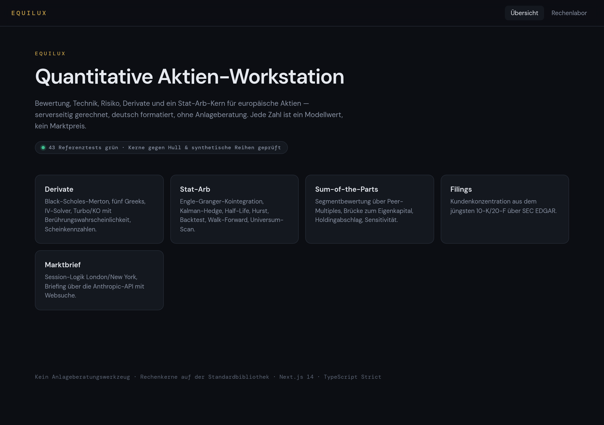
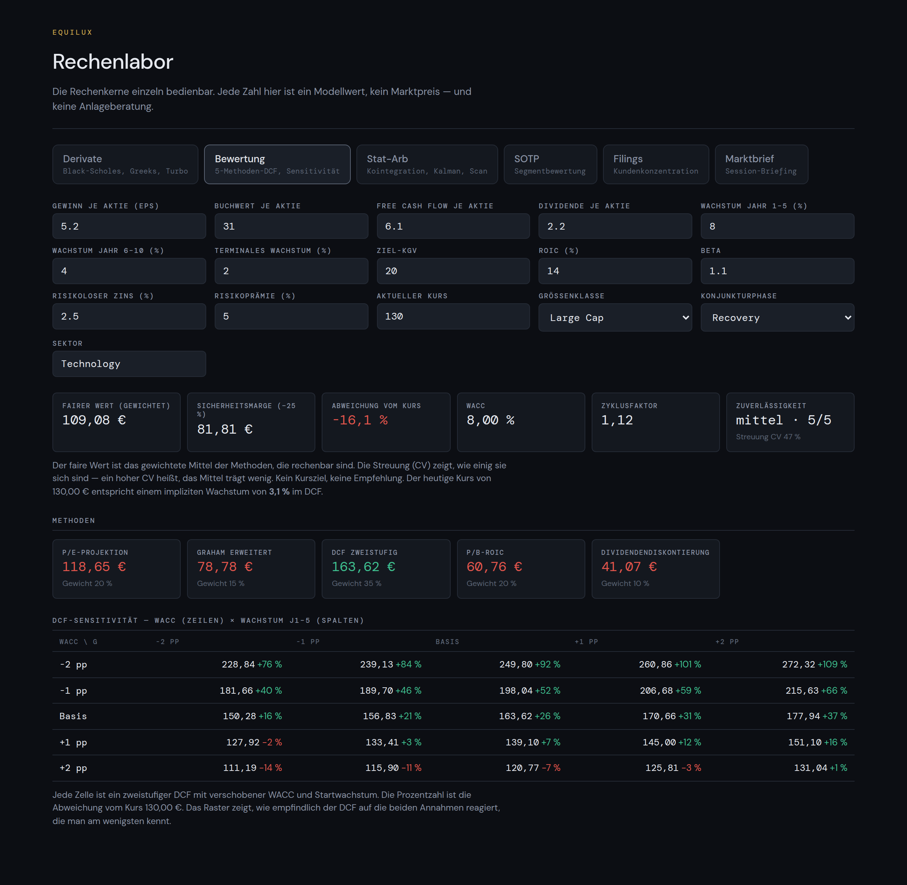
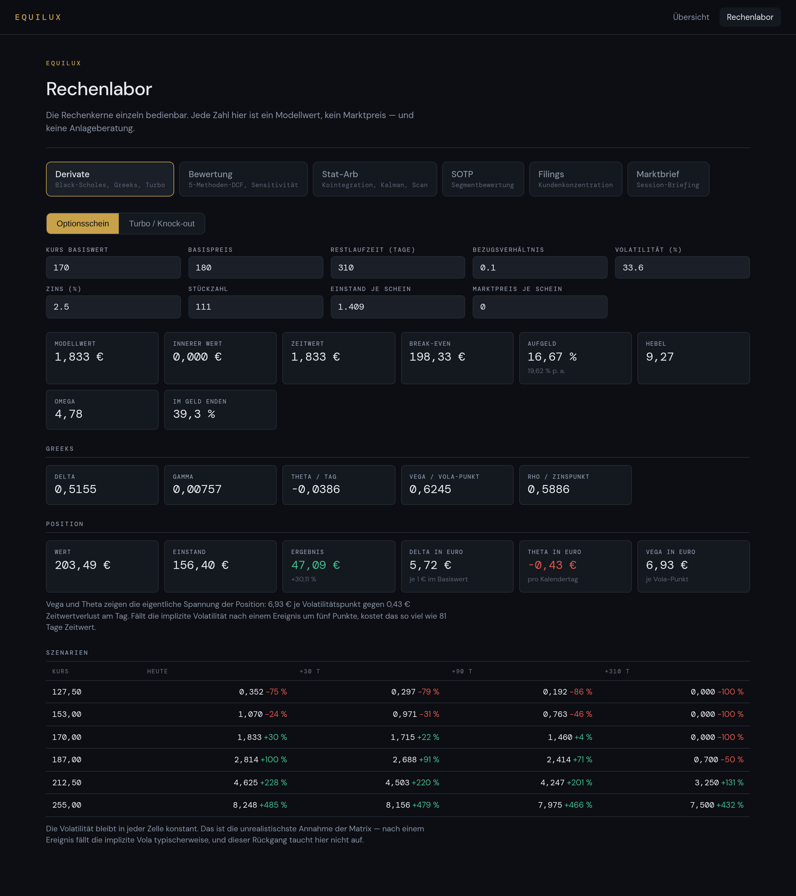

# EQUILUX

**Quantitative Aktien-Workstation im Bloomberg-Terminal-Stil.** Bewertung,
Technik, Risiko, Derivate und ein Stat-Arb-Kern für europäische Aktien —
serverseitig gerechnet, deutsch formatiert, ohne Anlageberatung.

Next.js 14 (App Router) · TypeScript Strict · Rechenkerne auf der
Standardbibliothek, ohne numerische Fremdpakete.



---

## Was das Projekt zeigt

EQUILUX ist ein Research-Werkzeug, kein Handelsprodukt. Der Anspruch liegt in
der Mathematik: Jeder Rechenkern ist gegen **bekannte Referenzwerte** geprüft,
nicht gegen sich selbst, und die Grenzen jedes Modells stehen im Ergebnis, nicht
im Kleingedruckten.

| Kern | Inhalt | Referenz |
|---|---|---|
| **Derivate** | Black-Scholes-Merton mit Dividendenrendite, fünf Greeks, IV-Solver per Bisektion, Turbo/Knock-out mit Berührungswahrscheinlichkeit (Erstpassierzeit), deutsche Scheinkennzahlen (Aufgeld, Hebel, Omega), Szenariomatrix | Hull: Call 10,4506 / Put 5,5735 / Delta 0,6368 |
| **Bewertung** | Fünf-Methoden-Modell: P/E-Projektion, Graham erweitert, zweistufiger DCF, P/B-ROIC, Dividendendiskontierung. WACC aus CAPM, Streuung der Methoden (CV), implizites Wachstum, DCF-Sensitivitätsraster | Gordon-Growth-Anker, WACC-Monotonie |
| **Stat-Arb** | Engle-Granger-Kointegration mit korrekten Residuen-Kritikwerten, Kalman-Hedge-Ratio, Half-Life, Hurst, Regime, Backtest (additiv, kostensensitiv), Walk-Forward, Universum-Scan | synthetische kointegrierte Reihen mit bekanntem β |
| **SOTP** | Segmentbewertung über Peer-Multiples, Brücke zum Eigenkapital, Holdingabschlag, Sensitivität, implizite Rückrechnung | — |
| **Filings** | Kundenkonzentration aus dem jüngsten 10-K/20-F über SEC EDGAR | — |
| **Marktbrief** | Session-Logik London/New York, Briefing über die Anthropic-API mit Websuche | — |



---

## Zwei Dinge, die dieses Projekt richtig macht

**1. ADF-Kritikwerte für Residuen, nicht für Reihen.** Der Augmented-Dickey-
Fuller-Test auf das Residuum einer Kointegrationsregression braucht strengere
Schwellen (Engle-Granger, −3,90/−3,34/−3,04) als der Test auf eine beobachtete
Reihe (−3,43/−2,86/−2,57). Das Residuum wurde von der Regression per
Konstruktion so stationär wie möglich gemacht — der gewöhnliche Test lehnt
sonst viel zu oft ab und produziert Trefferlisten voller Zufallsfunde. Beide
Werte stehen getrennt in `lib/quant/statarb.ts`.

**2. Kein Zinseszins auf Spread-Erträgen.** Bei marktneutralen Strategien mit
gleichbleibender Positionsgröße gibt es keinen Zinseszins. Die Ergebniskurve im
Backtest ist additiv; `riskPerSigma` skaliert das Risiko je Sigma. Ein
Backtest, der gleichzeitig einen positiven Sharpe und eine stark negative
Jahresrendite meldet, hat genau diesen Fehler — hier tritt er nicht auf.

Und eine Regel, die im Output sichtbar ist: **keine Anlageberatung.** Der
Bewertungskern liefert den fairen Modellwert, die Streuung der Methoden und die
Abweichung vom Kurs als reine Zahl. Kein Kursziel, kein „Kaufen/Verkaufen",
kein „attraktiv bewertet".

---

## Rechenkerne (Auswahl)

```
lib/quant/
  num.ts          Normalverteilung (erf, normCdf/Pdf/Inv), Statistik, deutsche Formate
  bs.ts           Black-Scholes-Merton, Greeks, IV-Solver, Turbo/KO, Scheinkennzahlen
  valuation.ts    Fünf-Methoden-DCF, Sensitivitätsraster, implizites Wachstum
  indicators.ts   RSI, MACD, ATR, Bollinger, Stochastik, S/R, Risikokennzahlen
  statarb.ts      OLS/MLR, ADF, Engle-Granger, Kalman, Half-Life, Hurst, Backtest, Scan
  sotp.ts         Segmentbewertung, Holdingabschlag, Sensitivität
  edgar.ts        Kundenkonzentration aus 10-K/20-F
  brief.ts        Session-Logik, Marktbrief
  universe.ts     165 europäische Titel in 15 Sektorgruppen
```

Das Rechenlabor unter `/labor` macht jeden Kern einzeln bedienbar. **Derivate**
und **Bewertung** rechnen im Browser und funktionieren ohne Netz; die übrigen
Kerne ziehen Live-Daten (EODHD / SEC EDGAR) serverseitig.



---

## Starten

```bash
npm install
npm run dev      # Entwicklung auf http://localhost:3000
npm run build    # Produktions-Build (muss ohne Fehler/Warnung durchlaufen)
npm test         # 43 Referenztests der Rechenkerne
```

Für den Marktbrief und EDGAR (serverseitig):

```bash
ANTHROPIC_API_KEY=sk-ant-...                      # nur für den Marktbrief
SEC_USER_AGENT="EQUILUX research (mail@example.de)"
```

Ohne Schlüssel funktioniert alles außer dem Marktbrief-Reiter. Kein Schlüssel
landet je im Client — Marktbrief und EDGAR laufen serverseitig
(`export const runtime = "nodejs"`).

---

## Deploy (Vercel)

EQUILUX ist ein Standard-Next.js-14-Projekt und läuft auf Vercel ohne
Zusatzkonfiguration:

1. Repo auf [vercel.com/new](https://vercel.com/new) importieren (GitHub
   verbinden, `Equilux` wählen).
2. Optionale Umgebungsvariablen setzen (Project → Settings → Environment
   Variables), siehe `.env.example`:
   - `ANTHROPIC_API_KEY` — nur für den Marktbrief-Kern
   - `SEC_USER_AGENT` — für den Filings-Kern (SEC EDGAR)
3. **Deploy.** Build-Command (`next build`) und Framework erkennt Vercel
   automatisch.

Ohne Variablen funktioniert alles außer Marktbrief; die Kurscharts, Stat-Arb
und Filings ziehen live von EODHD/SEC, sobald die Umgebung Netz nach außen
erlaubt (lokal und auf Vercel gegeben).

## Tests

```
$ npm test
Black-Scholes-Merton — Referenz Hull …    ✓ ✓ ✓ ✓ ✓ ✓ ✓ ✓
Implizite Volatilität — Rücklauf …         ✓ ✓ ✓ ✓
Turbo / Knock-out …                        ✓ ✓ ✓ ✓ ✓
Engle-Granger — synthetische Reihen …      ✓ ✓ ✓ ✓
ADF — Rauschen vs. Random Walk …           ✓ ✓
Bewertung — Gordon-Anker & Plausibilität … ✓ ✓ ✓ ✓ ✓
…
Ergebnis: 43 bestanden, 0 durchgefallen
```

Geprüft werden Optionspreise gegen Hull, Zeitreihenverfahren gegen synthetische
Reihen mit bekanntem Ergebnis, dazu Plausibilitätstests, die nicht nur
bestätigen: höhere Kosten müssen den Sharpe senken, höhere WACC den Wert, ein
ausgeknockter Schein muss null wert sein.

---

## Bewusste Grenzen

- **Kointegration** über Engle-Granger, nicht Johansen — für Zwei-Asset-Paare
  angemessen, Johansen lohnt erst ab mehr als zwei Assets.
- **Regime-Erkennung** über Hurst + Half-Life ist ein Heuristik-Filter, kein
  trainiertes Modell.
- **Backtest** ist spread-basiert zur Vorauswahl, keine
  Ausführungssimulation (Slippage/Finanzierung nur als Parameter).
- **Universum** ist eine kuratierte liquide Auswahl, keine offizielle
  Index-Mitgliederliste.
- **Kein Live-Order-Routing**, keine Portfoliosteuerung. EQUILUX erzeugt
  Signale und Kennzahlen, keine Orders.

---

## Stack

Next.js 14.2 · React 18 · TypeScript 5.5 (Strict) · CSS-Modules · DM Sans /
DM Mono. Die Rechenkerne laufen bewusst auf der Standardbibliothek — kein
numpy-Ersatz, kein Statistikpaket, kein Chart-Framework. Einzige
Dev-Abhängigkeit außerhalb des Frameworks: `tsx` als Test-Runner.

---

*Kein Anlageberatungswerkzeug. Beschreibt Lage und Risiken, bewertet nicht.*
